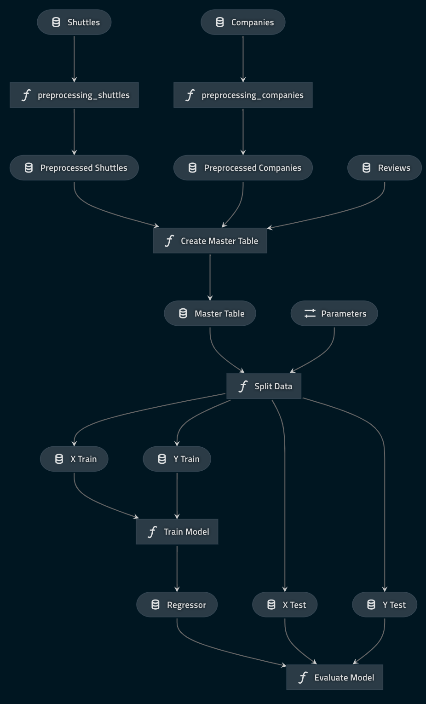

# The `kedro-starter-spaceflights` Kedro starter

## Overview

This is a tutorial project, which was generated using `Kedro 0.16.4`. It is the completed version of the [Space Flights tutorial](https://kedro.readthedocs.io/en/stable/03_tutorial/01_spaceflights_tutorial.html) described in the Kedro [documentation](https://kedro.readthedocs.io) and includes the data necessary to run the project.

The tutorial works through the steps necessary to create this project. To learn the most about Kedro, we recommend that you start with a blank template as the tutorial describes, and follow through all the working. However, if you prefer to read swiftly through the documentation and get to work on the code, you may want to generate a new Kedro project using this starter because the steps have been done for you.

To use this starter, create a new Kedro project using the commands below. To make sure you have the required dependencies, run in your virtual environment (see [the documentation](https://kedro.readthedocs.io/en/stable/02_getting_started/01_prerequisites.html#python-virtual-environments) for how to set up your virtual environment):

```bash
pip install kedro==0.16.4
kedro new --starter git+https://github.com/quantumblacklabs/kedro-starter-spaceflights.git
cd <my-project-name>  # cd into newly created project directory
```

Install the required dependencies:

```bash
kedro install
```

Now you can run the project:

```bash
kedro run
```

To visualise the default pipeline, run:
```bash
kedro viz
```

This will open the default browser and display the following pipeline visualisation:


